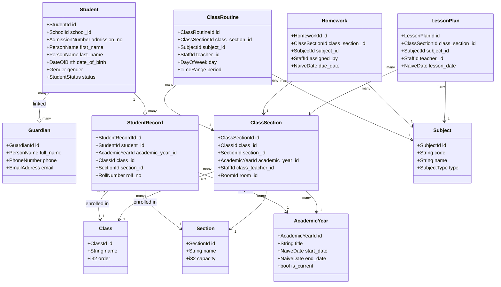
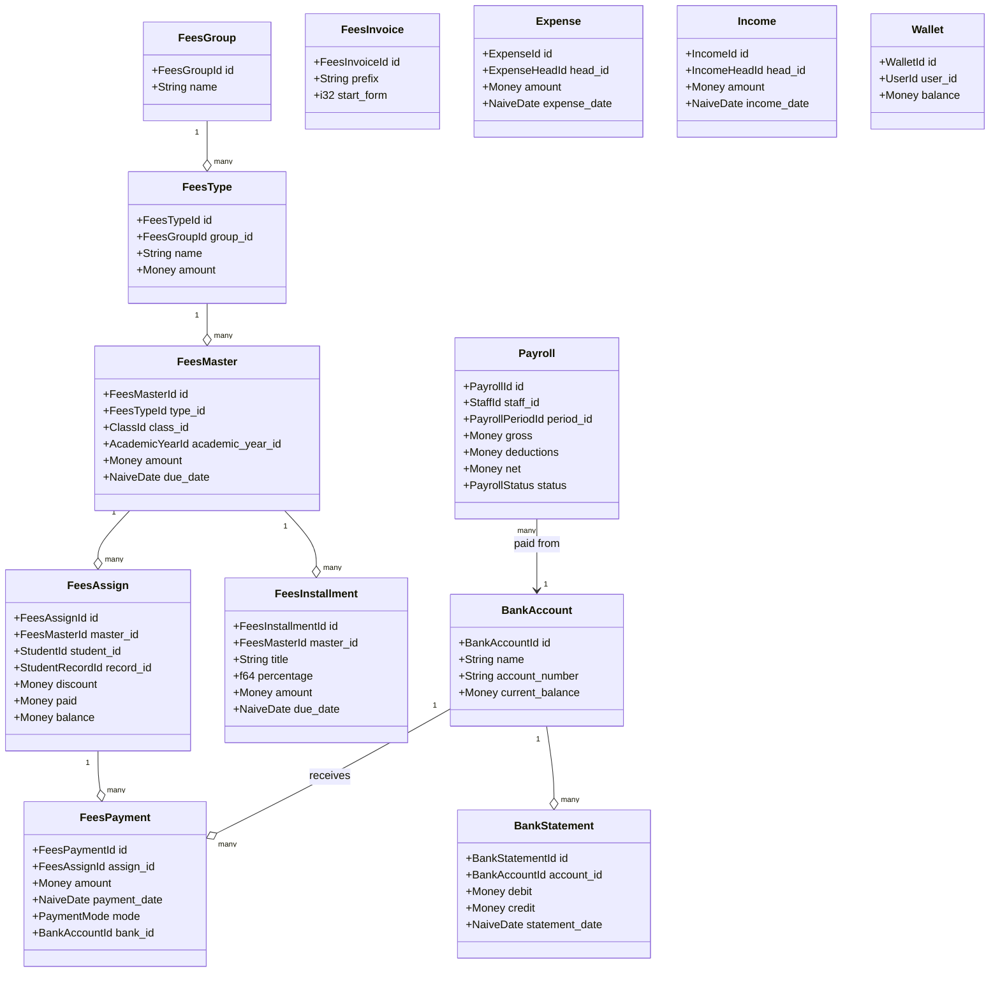
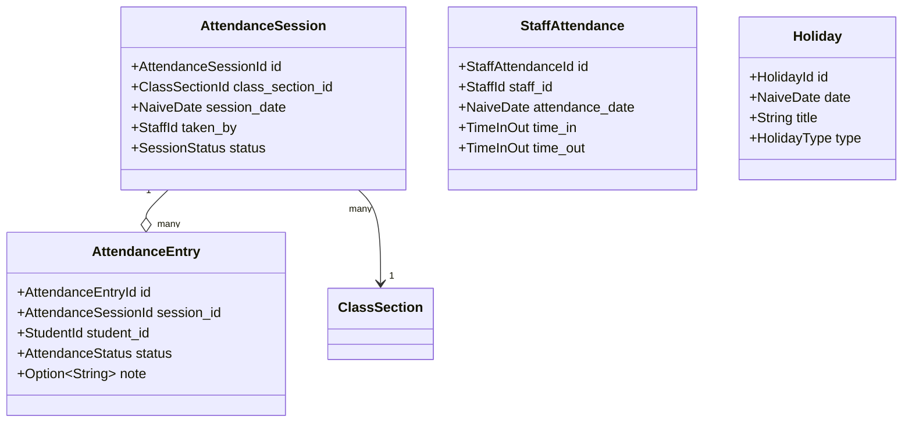
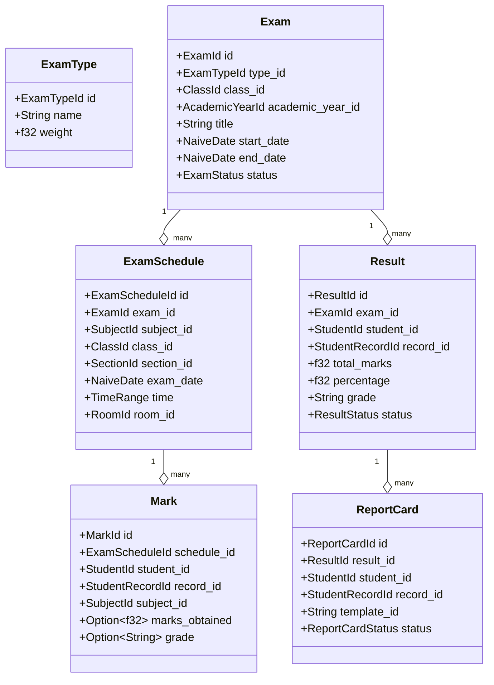
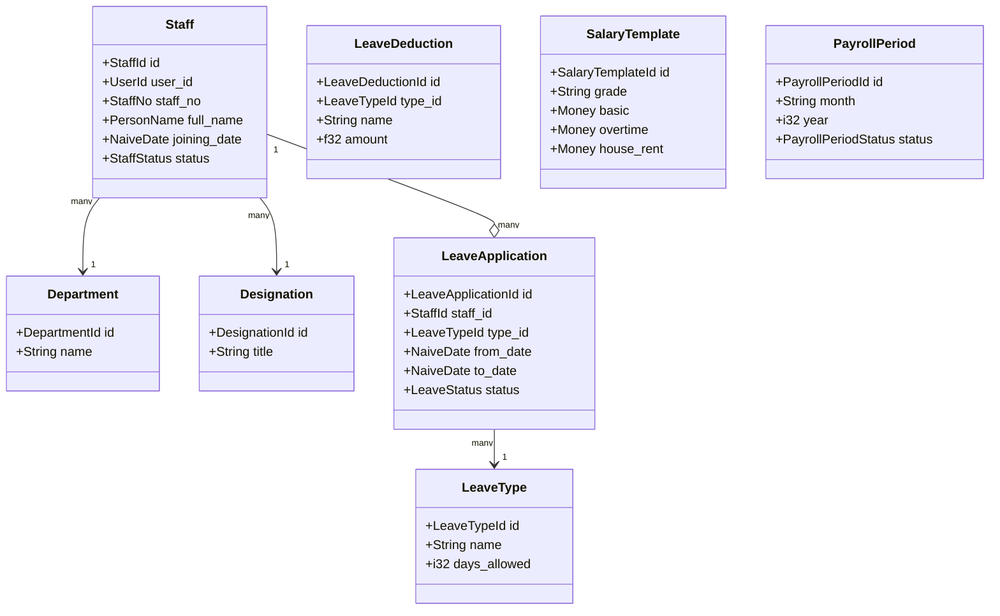
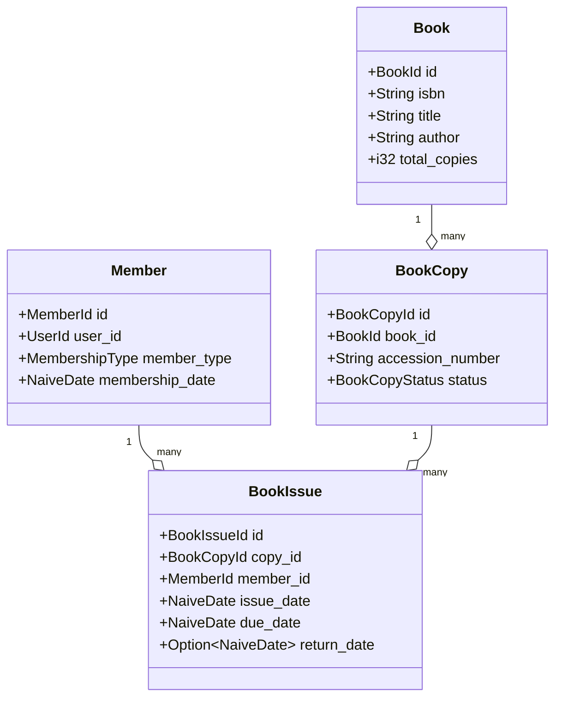
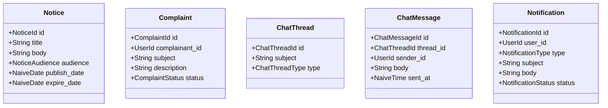
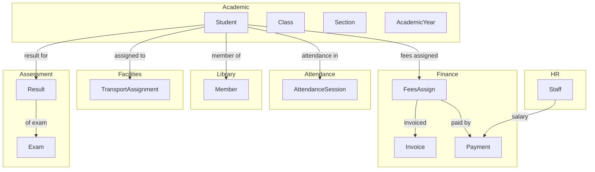

# Aggregate Map

This document maps the primary aggregate roots in each domain
and the key relationships between them.

## 1. Academic — The Foundational Domain

## 2. Finance — The Monetary Spine

## 3. Attendance

## 4. Assessment

## 5. HR

## 6. Library

## 7. Facilities (Transport / Hostel / Inventory)

```mermaid
classDiagram
    class TransportRoute {
        +TransportRouteId id
        +String name
        +f32 fare
    }
    class TransportVehicle {
        +TransportVehicleId id
        +String vehicle_number
        +i32 capacity
    }
    class TransportAssignment {
        +TransportAssignmentId id
        +TransportRouteId route_id
        +TransportVehicleId vehicle_id
        +StudentId student_id
        +PickupPoint pickup_point
    }
    class Hostel {
        +HostelId id
        +String name
        +HostelType type
    }
    class HostelRoom {
        +HostelRoomId id
        +HostelId hostel_id
        +String room_number
        +i32 capacity
    }
    class RoomAssignment {
        +RoomAssignmentId id
        +HostelRoomId room_id
        +StudentId student_id
        +NaiveDate assigned_date
    }
    class ItemCategory {
        +ItemCategoryId id
        +String name
    }
    class Item {
        +ItemId id
        +ItemCategoryId category_id
        +String name
        +i32 quantity
        +Money unit_price
    }
    class ItemIssue {
        +ItemIssueId id
        +ItemId item_id
        +UserId issued_to
        +i32 quantity
        +NaiveDate issue_date
    }
```

## 8. Communication

## 9. Cross-Aggregate Relationships

## 10. Aggregate Cardinality Quick Reference

| Aggregate             | Per School (typical) | Per Academic Year      |
| --------------------- | -------------------- | ---------------------- |
| `Student`             | 500 - 5,000          | active subset          |
| `Staff`               | 50 - 500             | active subset          |
| `Class`               | 10 - 20              | same                   |
| `Section`             | 30 - 100             | same                   |
| `Subject`             | 20 - 50              | same                   |
| `AttendanceSession`   | n/a                  | 200 / class / year     |
| `Exam`                | n/a                  | 4 - 8                  |
| `Mark`                | n/a                  | 5,000 - 50,000         |
| `Result`              | n/a                  | 500 - 5,000            |
| `FeesPayment`         | n/a                  | 10,000 - 100,000       |
| `Payroll`             | n/a                  | 600 - 6,000            |
| `Book`                | 500 - 10,000         | n/a                    |
| `BookIssue`           | n/a                  | 1,000 - 20,000         |
| `Notice`              | 50 - 500 / year      | n/a                    |
| `Notification`        | 10,000 - 500,000 / yr| n/a                    |
| `AuditRecord`         | n/a                  | 1M - 50M               |
