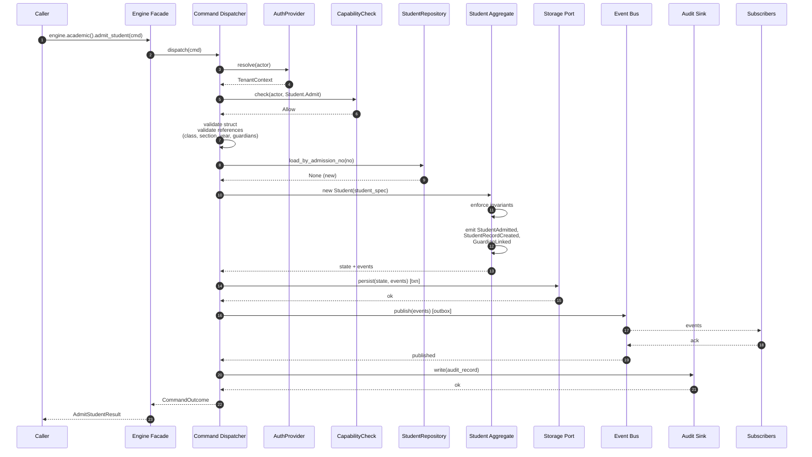
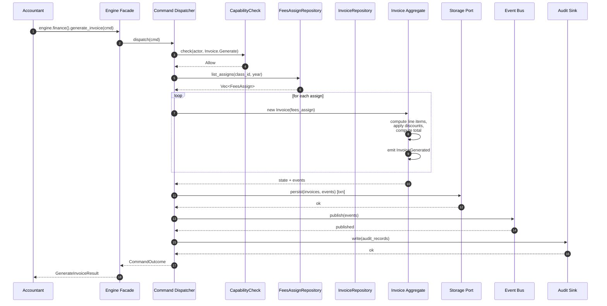
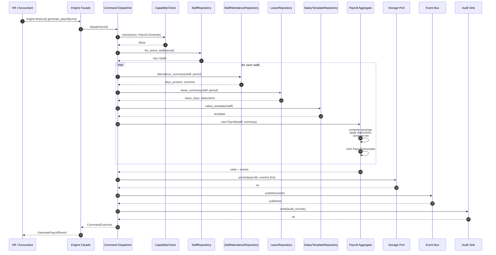
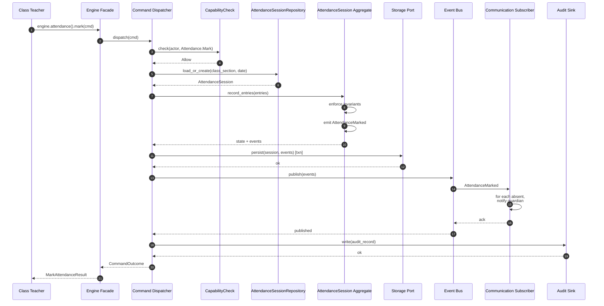
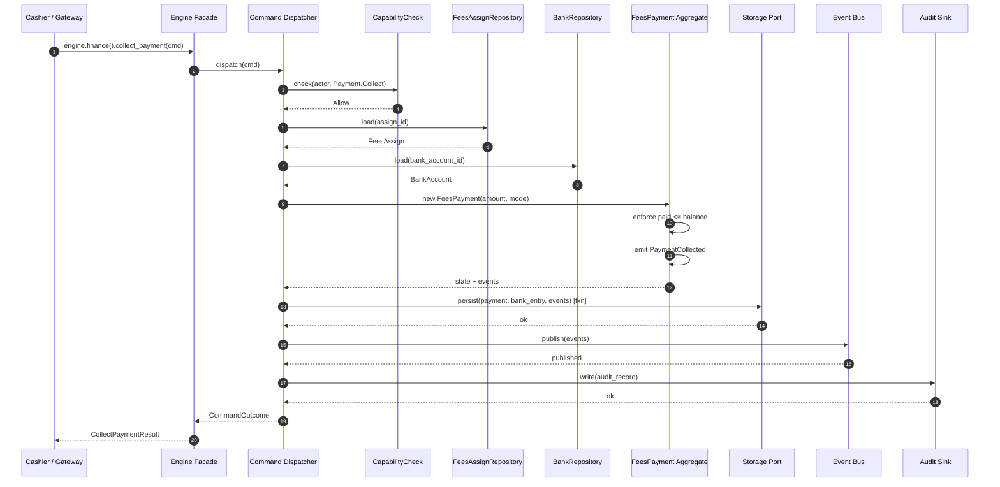
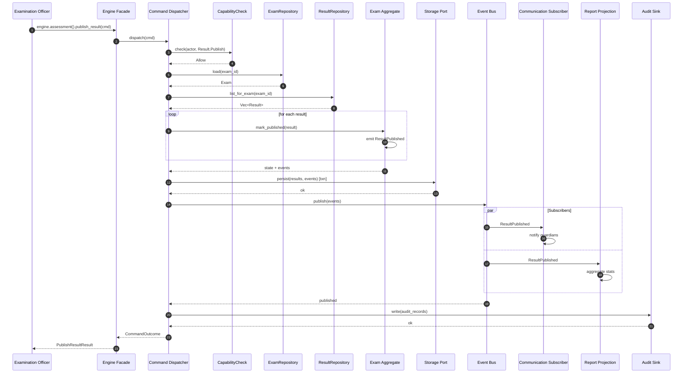
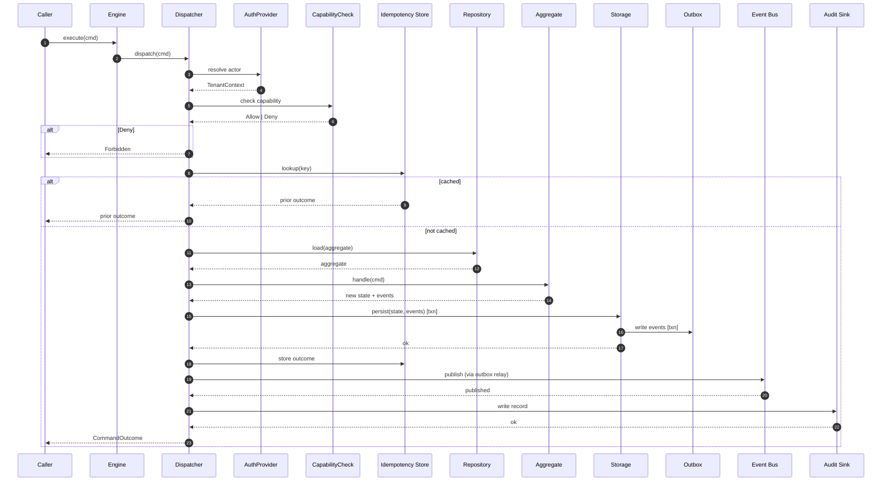
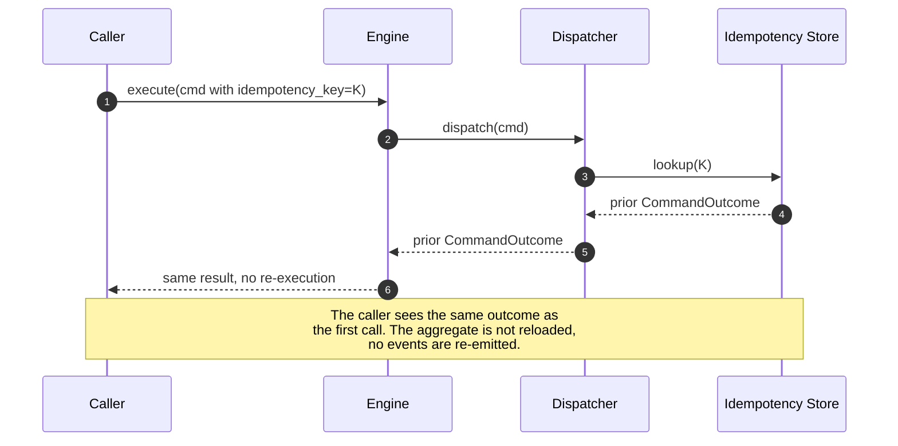

# Command Flow

Sequence diagrams for the engine's key commands. Each
diagram shows the call path from the consumer through
the dispatcher, the aggregate, the persistence layer,
the event bus, and the audit sink.

## 1. `AdmitStudent` — The Foundational Command

## 2. `GenerateInvoice` — Fees Invoice Generation

## 3. `GeneratePayroll` — Monthly Payroll Generation

## 4. `MarkAttendance` — Daily Bulk Operation

## 5. `CollectPayment` — Fee Collection

## 6. `PublishResult` — Examination Publication

## 7. Command Pipeline (Generic)

## 8. Idempotency Replay

