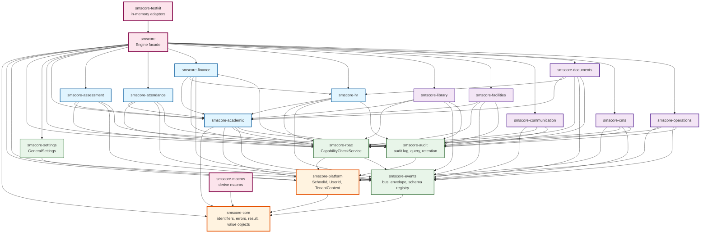
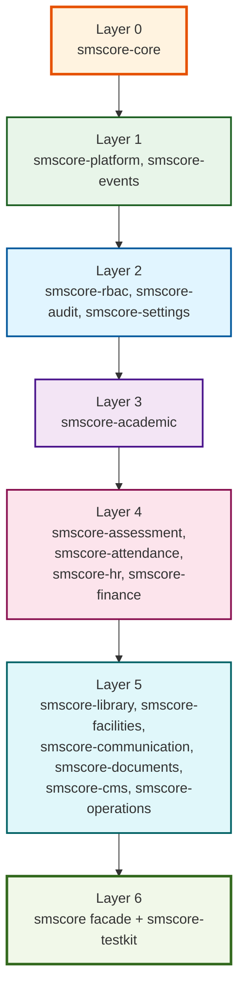
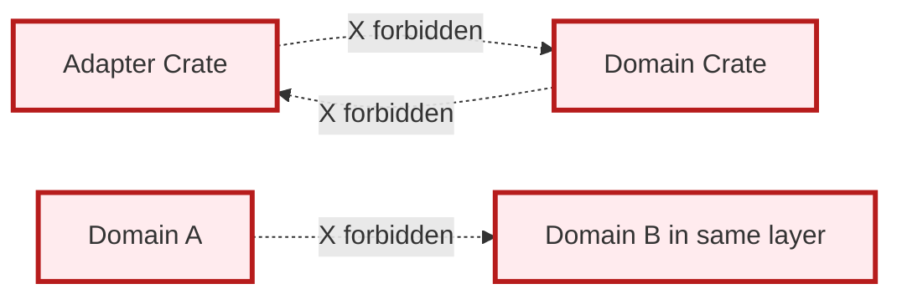
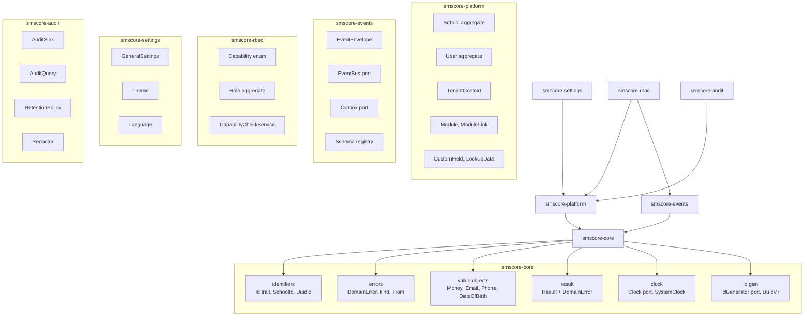
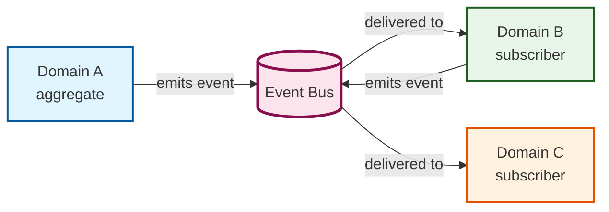

# Domain Dependency Map

A directed graph of every dependency the engine permits
between its crates. The graph is the authoritative answer
to "which crate may import which?" in SMScore.

## 1. Top-Level Dependency Graph

## 2. Layered View

## 3. Forbidden Edges

The engine enforces:

- **Adapters may not be imported by domain crates.**
  The dependency is one-way: domain defines a port;
  adapter implements it.
- **Domain crates may not import other domain crates
  in the same layer.** `smscore-finance` and
  `smscore-hr` are both layer 4; they do not import
  each other. They communicate through events.
- **Domain crates may not import the facade.** The
  facade re-exports the domain surface; importing
  it from a domain would create a cycle.

## 4. Foundation Crate Internal Layout

## 5. Domain Crate Standard Layout

```mermaid
graph TB
    Domain["smscore-<domain>/"]
    Domain --> Lib["src/lib.rs<br/>(re-exports public surface)"]
    Domain --> Aggregate["src/aggregate.rs<br/>(root types, invariants)"]
    Domain --> Entities["src/entities.rs<br/>(child entities)"]
    Domain --> ValueObjects["src/value_objects.rs<br/>(typed wrappers)"]
    Domain --> Commands["src/commands.rs<br/>(command structs + handlers)"]
    Domain --> Events["src/events.rs<br/>(event types)"]
    Domain --> Services["src/services.rs<br/>(domain services)"]
    Domain --> Policies["src/policies.rs<br/>(pure decision functions)"]
    Domain --> Repository["src/repository.rs<br/>(port trait)"]
    Domain --> Query["src/query.rs<br/>(query builder)"]
    Domain --> Errors["src/errors.rs<br/>(domain error enum)"]
    Domain --> Tests["tests/<br/>(integration tests)"]
    Domain --> Readme["README.md<br/>(crate purpose)"]
```

## 6. Cross-Domain Coordination Pattern

Cross-domain coordination happens through events.
Domain A does not call Domain B directly. Domain B
subscribes to Domain A's events and reacts. The bus
is the only shared medium.

## 7. Workspace Layout

```mermaid
graph TB
    Workspace["smscore (workspace)"]
    Workspace --> Cargo["Cargo.toml<br/>(workspace manifest)"]
    Workspace --> CargoLock["Cargo.lock<br/>(committed)"]
    Workspace --> Crates["crates/"]

    Crates --> Core["smscore-core/"]
    Crates --> Platform["smscore-platform/"]
    Crates --> Rbac["smscore-rbac/"]
    Crates --> Events["smscore-events/"]
    Crates --> Settings["smscore-settings/"]
    Crates --> Audit["smscore-audit/"]
    Crates --> Academic["smscore-academic/"]
    Crates --> Assessment["smscore-assessment/"]
    Crates --> Attendance["smscore-attendance/"]
    Crates --> Finance["smscore-finance/"]
    Crates --> Hr["smscore-hr/"]
    Crates --> Library["smscore-library/"]
    Crates --> Facilities["smscore-facilities/"]
    Crates --> Communication["smscore-communication/"]
    Crates --> Documents["smscore-documents/"]
    Crates --> Cms["smscore-cms/"]
    Crates --> Operations["smscore-operations/"]
    Crates --> Facade["smscore/<br/>(facade)"]
    Crates --> Testkit["smscore-testkit/"]
    Crates --> Macros["smscore-macros/"]
    Crates --> Cli["smscore-cli/"]
```

