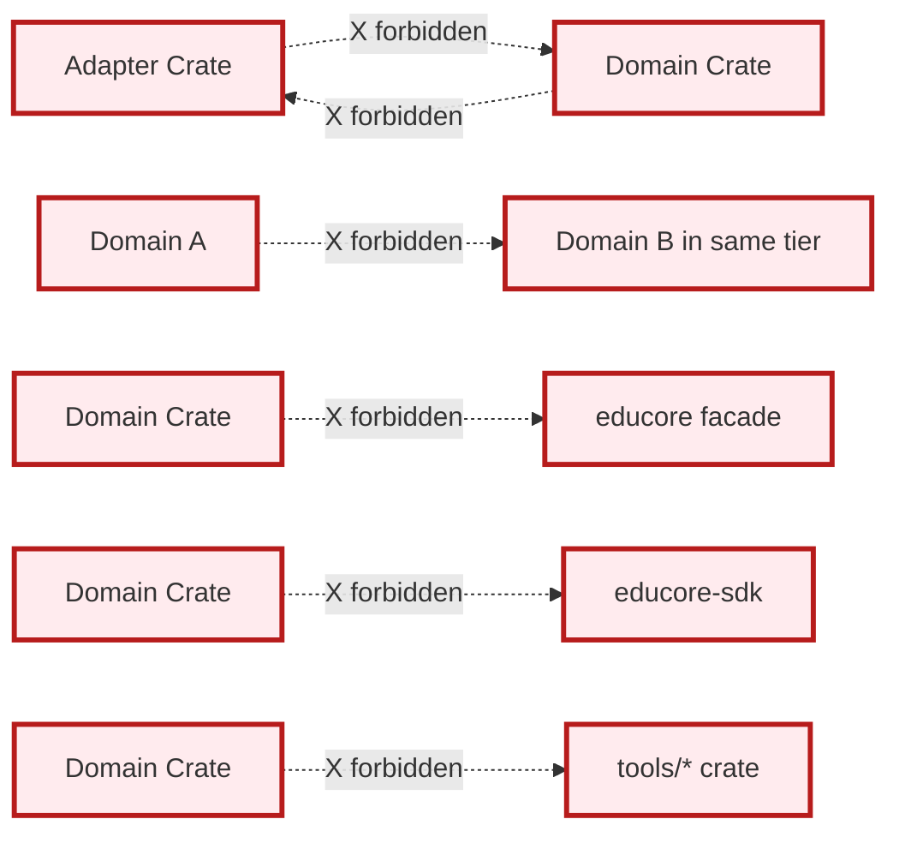
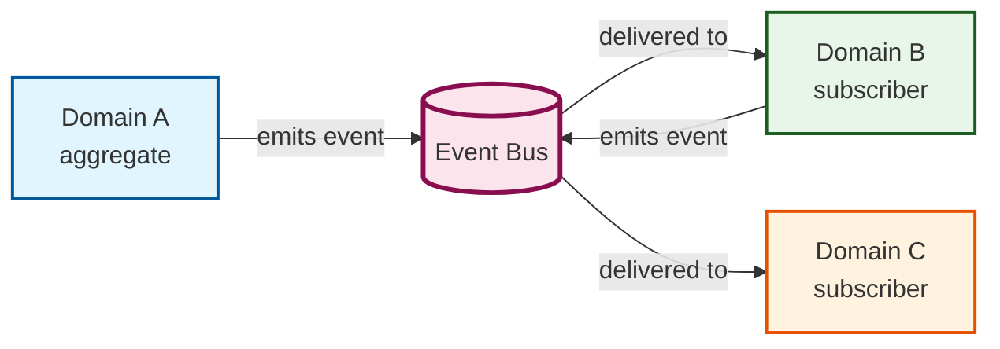

# Domain Dependency Map

A directed graph of every dependency the engine permits
between its 34 crates. Edges flow strictly upward: a
crate may only depend on crates in its own tier or
any tier below it. The authoritative allow/deny list
is [`AGENTS.md` § Dependency Rules](../../AGENTS.md#dependency-rules).

## 1. Crates by Tier

### core tier (3 crates) — infrastructure, depends on nothing

| Crate | Purpose |
| --- | --- |
| `educore-core` | Identifiers, `DomainError`, `Result`, value objects, clock, id generator. The root of every dependency. |
| `educore-query-derive` | Proc-macro crate that emits the typed query AST for `#[derive(DomainQuery)]`. The only macro crate shipped in v1. |
| `educore-storage` | Storage port trait; dialect-agnostic AST translation contract. |

### cross-cutting tier (7 crates) — cross-domain foundations

Each cross-cutting crate depends on `educore-core`. Some
additionally depend on `educore-platform`.

| Crate | Purpose |
| --- | --- |
| `educore-platform` | `School`, `User`, `TenantContext`, modules, custom fields. |
| `educore-rbac` | `Capability` enum, `Role` aggregate, `CapabilityCheckService`. |
| `educore-events` | `EventEnvelope`, `EventBus` and `Outbox` ports, schema registry. |
| `educore-events-domain` | Calendar and event-scheduling domain (the calendar, not the envelope). |
| `educore-audit` | `AuditSink`, `AuditQuery`, retention, redactor. Dev-dependency for domains; re-exported by the umbrella. |
| `educore-settings` | Per-school general settings, theme, language. |
| `educore-operations` | Cross-domain operations, jobs, scheduled tasks. |

### domains tier (10 crates) — the bounded contexts

Each domain crate depends on `educore-core`, `educore-platform`,
`educore-rbac`, and `educore-events`. Some additionally depend
on `educore-audit`. `educore-settings` omits `educore-audit`.

| Crate | Purpose |
| --- | --- |
| `educore-academic` | Academic year, classes, subjects, timetabling, grading scale. |
| `educore-assessment` | Examinations, marks, grade entry, report cards. |
| `educore-attendance` | Daily and period attendance, leave, notifications. |
| `educore-cms` | Content management: pages, menus, announcements. |
| `educore-communication` | Messaging, email, SMS, push channels. |
| `educore-documents` | Document storage and metadata (the engine-side catalog; files live in `educore-files`). |
| `educore-facilities` | Rooms, assets, inventory, maintenance. |
| `educore-finance` | Fees, invoices, payments, ledgers. |
| `educore-hr` | Staff records, payroll inputs, contracts. |
| `educore-library` | Books, lending, reservations. |

### adapters tier (9 crates) — port implementations

Storage and event-bus adapters depend on `educore-storage` /
`educore-events` and may not be imported by domain crates. The
6 port adapters (auth, files, integrations, notify, payment, ...)
implement the engine's outbound ports for specific backends.

| Crate | Purpose |
| --- | --- |
| `educore-storage-postgres` | PostgreSQL 14+ storage adapter; reference DDL emitter. |
| `educore-storage-mysql` | MySQL 8.0+ storage adapter; production target. |
| `educore-storage-sqlite` | SQLite 3.x storage adapter; embedded and offline mode. |
| `educore-event-bus` | In-process `EventBus` adapter implementing the `educore-events` port. |
| `educore-auth` | Identity, sessions, OAuth/OIDC. |
| `educore-files` | Object storage adapter (S3, local, GCS). |
| `educore-integrations` | Third-party integration adapters (LMS, SIS, proctors). |
| `educore-notify` | Notification channel adapters (email, SMS, push). |
| `educore-payment` | Payment gateway adapters (Stripe, Razorpay, manual). |

### tools tier (4 crates) — dev tooling

| Crate | Purpose |
| --- | --- |
| `educore-testkit` | In-memory adapters and test helpers; used by domain and integration tests. |
| `educore-storage-parity` | Cross-dialect conformance harness; runs the same test suite against every storage adapter. |
| `educore-sdk` | High-level consumer SDK; convenient builders for the common flows. |
| `educore-cli` | Sample binary CLI (`[[bin]]`); not a library. Demonstrates consumer use of the umbrella. |

### umbrella (1 crate)

| Crate | Purpose |
| --- | --- |
| `educore` | Umbrella crate; re-exports every public crate under `educore::*` and is the only crate consumers are expected to depend on directly. |

## 2. Top-Level Dependency Graph

The Mermaid diagram below shows the 34 crates and the
permitted dependency edges. Edges point from dependent
to dependency. A crate in a higher tier depends only on
crates in its own tier or lower; it never depends on a
crate in a higher tier. Mermaid identifiers cannot
contain hyphens, so node IDs use underscores; the human-
readable label uses the hyphenated package name.

```mermaid
graph TD
    classDef core fill:#fff3e0,stroke:#e65100,stroke-width:3px
    classDef cross fill:#e8f5e9,stroke:#1b5e20,stroke-width:2px
    classDef domain fill:#f3e5f5,stroke:#4a148c,stroke-width:2px
    classDef adapter fill:#e1f5ff,stroke:#01579b,stroke-width:2px
    classDef tool fill:#e0f7fa,stroke:#006064,stroke-width:3px
    classDef umbrella fill:#fce4ec,stroke:#880e4f,stroke-width:3px

    %% core tier
    core["educore-core"]:::core
    query_derive["educore-query-derive"]:::core
    storage["educore-storage"]:::core
    %% core internal edges
    query_derive --> core
    storage --> core
    %% cross-cutting tier
    platform["educore-platform"]:::cross
    rbac["educore-rbac"]:::cross
    events["educore-events"]:::cross
    events_domain["educore-events-domain"]:::cross
    audit["educore-audit"]:::cross
    settings["educore-settings"]:::cross
    operations["educore-operations"]:::cross
    %% cross-cutting internal edges
    platform --> core
    rbac --> core & platform & events
    events --> core
    events_domain --> core & platform & rbac & events & audit
    audit --> platform & core
    settings --> core & platform & rbac & events
    operations --> core & platform & rbac & events & audit
    %% domains tier
    academic["educore-academic"]:::domain
    assessment["educore-assessment"]:::domain
    attendance["educore-attendance"]:::domain
    cms["educore-cms"]:::domain
    communication["educore-communication"]:::domain
    documents["educore-documents"]:::domain
    facilities["educore-facilities"]:::domain
    finance["educore-finance"]:::domain
    hr["educore-hr"]:::domain
    library["educore-library"]:::domain
    %% domain internal edges: every domain depends on core+platform+rbac+events;
    %% many also use audit.
    academic & assessment & attendance & cms & communication & documents & facilities & finance & hr & library --> core & platform & rbac & events
    academic & assessment & attendance & cms & communication & documents & facilities & finance & hr & library --> audit
    %% adapters tier
    storage_postgres["educore-storage-postgres"]:::adapter
    storage_mysql["educore-storage-mysql"]:::adapter
    storage_sqlite["educore-storage-sqlite"]:::adapter
    event_bus["educore-event-bus"]:::adapter
    auth["educore-auth"]:::adapter
    files["educore-files"]:::adapter
    integrations["educore-integrations"]:::adapter
    notify["educore-notify"]:::adapter
    payment["educore-payment"]:::adapter
    %% adapter internal edges
    storage_postgres --> storage & core
    storage_mysql --> storage & core
    storage_sqlite --> storage & core
    event_bus --> events & core
    auth --> core & storage & events
    files --> core & storage & events
    integrations --> core & events
    notify --> core & events
    payment --> core & storage & events
    %% tools tier
    testkit["educore-testkit"]:::tool
    storage_parity["educore-storage-parity"]:::tool
    sdk["educore-sdk"]:::tool
    cli["educore-cli"]:::tool
    %% tool internal edges
    testkit --> core & storage & events
    storage_parity --> core & storage_postgres & storage_mysql & storage_sqlite
    sdk --> core & platform & events & rbac & settings
    cli --> umbrella & sdk
    %% umbrella re-exports every public crate
    umbrella["educore<br/>umbrella"]:::umbrella
    umbrella --> core & query_derive & storage
    umbrella --> platform & rbac & events & events_domain & audit & settings & operations
    umbrella --> academic & assessment & attendance & cms & communication & documents & facilities & finance & hr & library
    umbrella --> storage_postgres & storage_mysql & storage_sqlite & storage_parity & event_bus
    umbrella --> auth & files & integrations & notify & payment
    umbrella --> testkit & sdk
```

## 3. Forbidden Edges

The engine enforces:

- **Adapters may not be imported by domain crates.**
  The dependency is one-way: domain defines a port;
  adapter implements it.
- **Domain crates may not import other domain crates
  in the same tier.** `educore-finance` and
  `educore-hr` are both in the domains tier; they
  do not import each other. They communicate through
  events.
- **Domain crates may not import the umbrella, the SDK,
  `educore-cli`, or any other `tools/*` crate.** The
  umbrella and SDK re-export the domain surface;
  importing either from a domain would create a cycle.
- **The proc-macro crate `educore-query-derive` is a
  leaf.** It depends on `syn`/`quote` only and is used
  by every domain crate at compile time. No runtime
  crate may depend on it.
- **`educore-audit`, `educore-testkit`, and
  `educore-storage-parity` are not load-bearing for
  production.** They are imported only by the umbrella
  and (for `testkit`/`storage-parity`) by the workspace
  test harness. Domains treat them as optional
  dev-dependencies.

## 4. Cross-Domain Coordination Pattern

Cross-domain coordination happens through events.
Domain A does not call Domain B directly. Domain B
subscribes to Domain A's events and reacts. The bus
is the only shared medium. The `EventBus` port lives
in `educore-events`; the default in-process adapter
is `educore-event-bus`.

## See also

- [`AGENTS.md` § Dependency Rules](../../AGENTS.md#dependency-rules) — the authoritative allow/deny list.
- [`AGENTS.md` § Tier System](../../AGENTS.md#tier-system) — the on-disk tier tree and dependency direction.
- [`AGENTS.md` § Workspace Layout](../../AGENTS.md#workspace-layout) — the on-disk tree of crates.
- [`AGENTS.md` § Project Identity](../../AGENTS.md#project-identity) — package-vs-directory naming convention.
- [`docs/architecture.md`](../architecture.md) — the broader system map.
