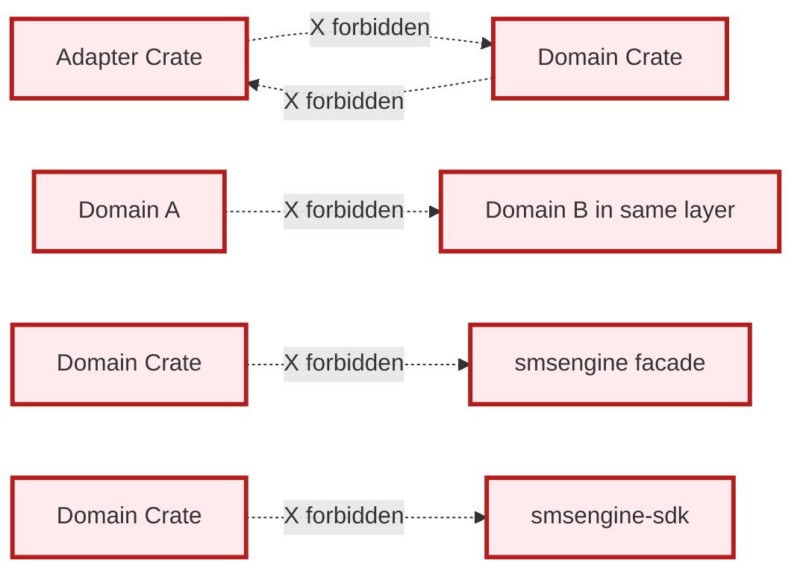
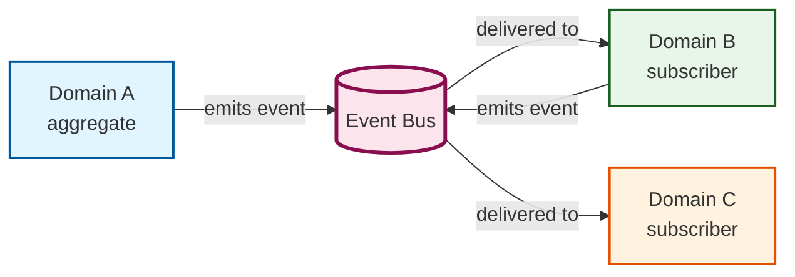

# Domain Dependency Map

A directed graph of every dependency the engine permits
between its 34 crates. Edges flow strictly upward: a
crate may only depend on crates in its own layer or
any layer below it. The authoritative allow/deny list
is [`AGENTS.md` § Dependency Rules](../../AGENTS.md#dependency-rules).

## 1. Crates by Layer

### Layer 0 — Leaf

| Crate | Purpose |
| --- | --- |
| `smsengine-core` | Identifiers, `DomainError`, `Result`, value objects, clock, id generator. The root of every dependency. |
| `smsengine-query-derive` | Proc-macro crate that emits the typed query AST for `#[derive(DomainQuery)]`. The only macro crate shipped in v1. |

### Layer 1 — Cross-cutting

| Crate | Purpose |
| --- | --- |
| `smsengine-storage` | Storage port trait; dialect-agnostic AST translation contract. |
| `smsengine-platform` | `School`, `User`, `TenantContext`, modules, custom fields. |
| `smsengine-rbac` | `Capability` enum, `Role` aggregate, `CapabilityCheckService`. |
| `smsengine-events` | `EventEnvelope`, `EventBus` and `Outbox` ports, schema registry. |
| `smsengine-audit` | `AuditSink`, `AuditQuery`, retention, redactor. Dev-dependency for domains; re-exported by the umbrella. |

### Layer 2 — Adapters

| Crate | Purpose |
| --- | --- |
| `smsengine-storage-postgres` | PostgreSQL 14+ storage adapter; reference DDL emitter. |
| `smsengine-storage-mysql` | MySQL 8.0+ storage adapter; production target. |
| `smsengine-storage-sqlite` | SQLite 3.x storage adapter; embedded and offline mode. |
| `smsengine-event-bus` | In-process `EventBus` adapter implementing the `smsengine-events` port. |

### Layer 3 — Domains

Each domain crate depends on `smsengine-core`, `smsengine-platform`,
`smsengine-rbac`, and `smsengine-events`. Some additionally depend
on `smsengine-audit`.

| Crate | Purpose |
| --- | --- |
| `smsengine-events-domain` | Calendar and event-scheduling domain (the calendar, not the envelope). |
| `smsengine-academic` | Academic year, classes, subjects, timetabling, grading scale. |
| `smsengine-assessment` | Examinations, marks, grade entry, report cards. |
| `smsengine-attendance` | Daily and period attendance, leave, notifications. |
| `smsengine-cms` | Content management: pages, menus, announcements. |
| `smsengine-communication` | Messaging, email, SMS, push channels. |
| `smsengine-documents` | Document storage and metadata (the engine-side catalog; files live in `smsengine-files`). |
| `smsengine-facilities` | Rooms, assets, inventory, maintenance. |
| `smsengine-finance` | Fees, invoices, payments, ledgers. |
| `smsengine-hr` | Staff records, payroll inputs, contracts. |
| `smsengine-library` | Books, lending, reservations. |
| `smsengine-operations` | Cross-domain operations, jobs, scheduled tasks. |
| `smsengine-settings` | Per-school general settings, theme, language. |

### Layer 4 — Port adapters

Port adapters implement the storage and event-bus ports for
specific backends. They depend on `smsengine-storage` /
`smsengine-events` and may not be imported by domain crates.

| Crate | Purpose |
| --- | --- |
| `smsengine-auth` | Identity, sessions, OAuth/OIDC. |
| `smsengine-files` | Object storage adapter (S3, local, GCS). |
| `smsengine-integrations` | Third-party integration adapters (LMS, SIS, proctors). |
| `smsengine-notify` | Notification channel adapters (email, SMS, push). |
| `smsengine-payment` | Payment gateway adapters (Stripe, Razorpay, manual). |

### Layer 5 — High-level

| Crate | Purpose |
| --- | --- |
| `smsengine-testkit` | In-memory adapters and test helpers; used by domain and integration tests. |
| `smsengine-storage-parity` | Cross-dialect conformance harness; runs the same test suite against every storage adapter. |
| `smsengine-sdk` | High-level consumer SDK; convenient builders for the common flows. |
| `smsengine-cli` | Sample binary CLI (`[[bin]]`); not a library. Demonstrates consumer use of the umbrella. |
| `smsengine` | Umbrella crate; re-exports every public crate under `smsengine::*` and is the only crate consumers are expected to depend on directly. |

## 2. Top-Level Dependency Graph

The Mermaid diagram below shows the 34 crates and the
permitted dependency edges. Edges point from dependent
to dependency. A crate in a higher layer depends only on
crates in its own layer or lower; it never depends on a
crate in a higher layer. Mermaid identifiers cannot
contain hyphens, so node IDs use underscores; the human-
readable label uses the hyphenated package name.

```mermaid
graph TD
    classDef leaf fill:#fff3e0,stroke:#e65100,stroke-width:3px
    classDef cross fill:#e8f5e9,stroke:#1b5e20,stroke-width:2px
    classDef adapter fill:#e1f5ff,stroke:#01579b,stroke-width:2px
    classDef domain fill:#f3e5f5,stroke:#4a148c,stroke-width:2px
    classDef port fill:#fce4ec,stroke:#880e4f,stroke-width:2px
    classDef high fill:#e0f7fa,stroke:#006064,stroke-width:3px

    %% Layer 0
    core["smsengine-core"]:::leaf
    query_derive["smsengine-query-derive"]:::leaf
    %% Layer 1
    storage["smsengine-storage"]:::cross
    platform["smsengine-platform"]:::cross
    rbac["smsengine-rbac"]:::cross
    events["smsengine-events"]:::cross
    audit["smsengine-audit"]:::cross
    %% Layer 2
    storage_postgres["smsengine-storage-postgres"]:::adapter
    storage_mysql["smsengine-storage-mysql"]:::adapter
    storage_sqlite["smsengine-storage-sqlite"]:::adapter
    event_bus["smsengine-event-bus"]:::adapter
    %% Layer 3
    events_domain["smsengine-events-domain"]:::domain
    academic["smsengine-academic"]:::domain
    assessment["smsengine-assessment"]:::domain
    attendance["smsengine-attendance"]:::domain
    cms["smsengine-cms"]:::domain
    communication["smsengine-communication"]:::domain
    documents["smsengine-documents"]:::domain
    facilities["smsengine-facilities"]:::domain
    finance["smsengine-finance"]:::domain
    hr["smsengine-hr"]:::domain
    library["smsengine-library"]:::domain
    operations["smsengine-operations"]:::domain
    settings["smsengine-settings"]:::domain
    %% Layer 4
    auth["smsengine-auth"]:::port
    files["smsengine-files"]:::port
    integrations["smsengine-integrations"]:::port
    notify["smsengine-notify"]:::port
    payment["smsengine-payment"]:::port
    %% Layer 5
    testkit["smsengine-testkit"]:::high
    storage_parity["smsengine-storage-parity"]:::high
    sdk["smsengine-sdk"]:::high
    cli["smsengine-cli"]:::high
    umbrella["smsengine<br/>umbrella"]:::high

    %% Layer 1 edges
    storage --> core
    platform --> core
    rbac --> core & platform & events
    events --> core
    audit --> platform & core
    %% Layer 2 edges
    storage_postgres --> storage & core
    storage_mysql --> storage & core
    storage_sqlite --> storage & core
    event_bus --> events & core
    %% Layer 3 edges: every domain depends on core+platform+rbac+events;
    %% many also use audit. settings omits audit.
    events_domain & academic & assessment & attendance & cms & communication & documents & facilities & finance & hr & library & operations --> core & platform & rbac & events
    events_domain & academic & assessment & attendance & cms & communication & documents & facilities & finance & hr & library & operations --> audit
    settings --> core & platform & rbac & events
    %% Layer 4 edges
    auth --> core & storage & events
    files --> core & storage & events
    integrations --> core & events
    notify --> core & events
    payment --> core & storage & events
    %% Layer 5 edges
    testkit --> core & storage & events
    storage_parity --> core & storage_postgres & storage_mysql & storage_sqlite
    sdk --> core & platform & events & rbac & settings
    cli --> umbrella & sdk
    %% Umbrella re-exports every public crate
    umbrella --> core & platform & rbac & events & settings & audit
    umbrella --> events_domain & academic & assessment & attendance & cms & communication & documents & facilities & finance & hr & library & operations
    umbrella --> storage & storage_postgres & storage_mysql & storage_sqlite & storage_parity & event_bus
    umbrella --> auth & files & integrations & notify & payment
    umbrella --> testkit & sdk
```

## 3. Forbidden Edges

The engine enforces:

- **Adapters may not be imported by domain crates.**
  The dependency is one-way: domain defines a port;
  adapter implements it.
- **Domain crates may not import other domain crates
  in the same layer.** `smsengine-finance` and
  `smsengine-hr` are both layer 3; they do not import
  each other. They communicate through events.
- **Domain crates may not import the umbrella, the SDK,
  or `smsengine-cli`.** The umbrella and SDK re-export
  the domain surface; importing either from a domain
  would create a cycle.
- **The proc-macro crate `smsengine-query-derive` is a
  leaf.** It depends on `syn`/`quote` only and is used
  by every domain crate at compile time. No runtime
  crate may depend on it.
- **`smsengine-audit`, `smsengine-testkit`, and
  `smsengine-storage-parity` are not load-bearing for
  production.** They are imported only by the umbrella
  and (for `testkit`/`storage-parity`) by the workspace
  test harness. Domains treat them as optional
  dev-dependencies.

## 4. Cross-Domain Coordination Pattern

Cross-domain coordination happens through events.
Domain A does not call Domain B directly. Domain B
subscribes to Domain A's events and reacts. The bus
is the only shared medium. The `EventBus` port lives
in `smsengine-events`; the default in-process adapter
is `smsengine-event-bus`.

## See also

- [`AGENTS.md` § Dependency Rules](../../AGENTS.md#dependency-rules) — the authoritative allow/deny list.
- [`AGENTS.md` § Workspace Layout](../../AGENTS.md#workspace-layout) — the on-disk tree of crates.
- [`AGENTS.md` § Project Identity](../../AGENTS.md#project-identity) — package-vs-directory naming convention.
- [`docs/architecture.md`](../architecture.md) — the broader system map.
