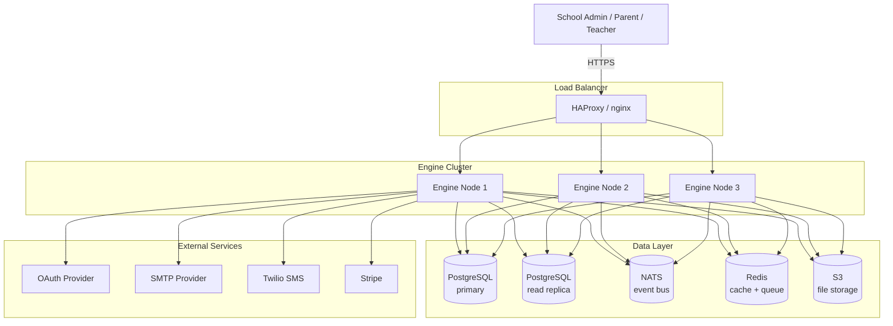
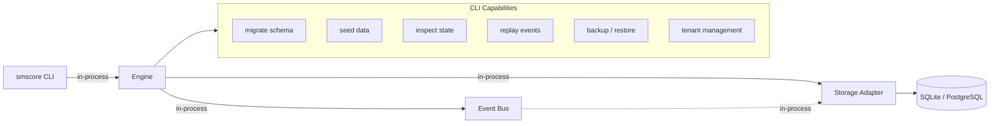
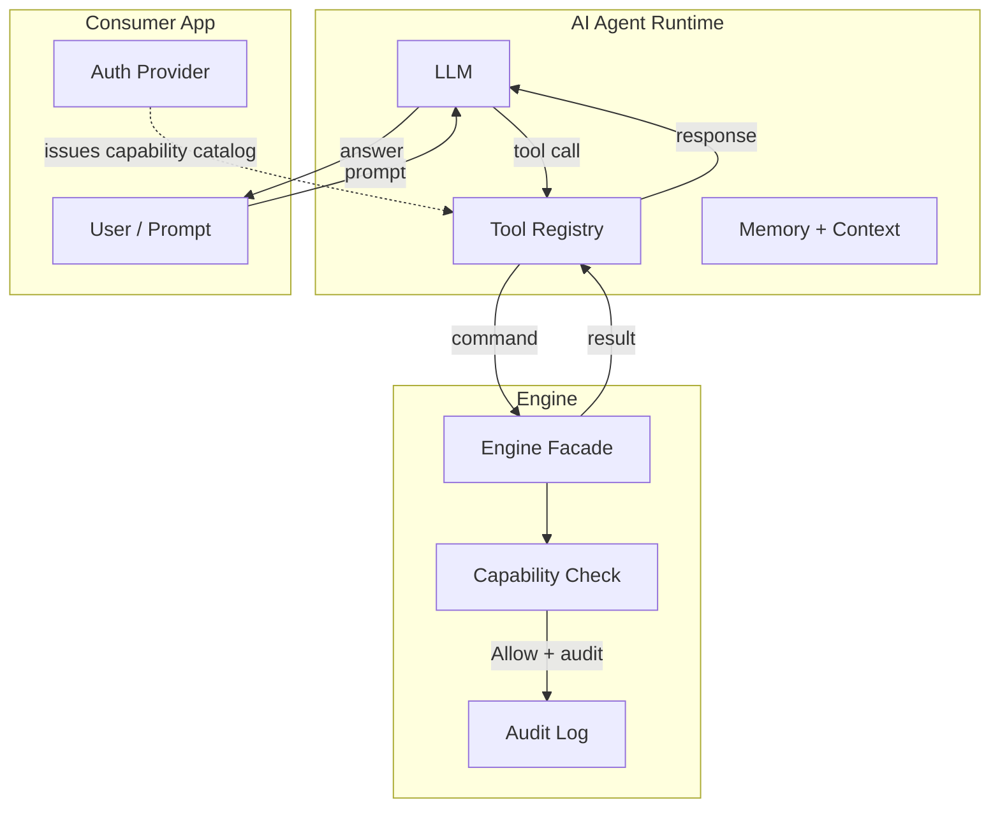

# Deployment Map

How a consumer application is structured with the SMScore
engine. The maps below show the consumer's surface, the
engine's facade, the command flow, and the runtime topology.

## 1. Consumer Architecture

```mermaid
graph TB
    subgraph consumerApp [Consumer Application]
        UI[UI Layer<br/>(web, mobile, desktop, CLI)]
        API[API Layer<br/>(HTTP, GraphQL, RPC, gRPC)]
        Service[Service Layer<br/>(consumer business logic)]
        Adapter[Adapter Layer<br/>(implements engine ports)]
    end

    subgraph engine [SMScore Engine]
        Facade[Engine Facade<br/>smscore::Engine]
        Domain[Domain Crates<br/>smscore-academic, smscore-finance, ...]
        Ports[Port Traits<br/>Storage, Auth, Notification, ...]
    end

    subgraph infra [Infrastructure]
        DB[(Database<br/>PostgreSQL / SQLite / SurrealDB)]
        Bus[(Event Bus<br/>NATS / Redis / In-process)]
        AuthProvider[(Auth<br/>OAuth / SAML / Local)]
        NotifProvider[(Notification<br/>SMTP / SMS / FCM)]
        PayProvider[(Payment<br/>Stripe / PayPal / Bank)]
        FileStore[(File Storage<br/>S3 / GCS / Local)]
    end

    UI --> Service
    API --> Service
    Service --> Facade
    Service --> Adapter
    Facade --> Domain
    Domain -.uses.-> Ports
    Adapter -.implements.-> Ports
    Adapter --> DB
    Adapter --> Bus
    Adapter --> AuthProvider
    Adapter --> NotifProvider
    Adapter --> PayProvider
    Adapter --> FileStore
```

## 2. Multi-Surface Consumer

```mermaid
graph TB
    subgraph surfaces [Surfaces]
        Web[Web Admin<br/>(React + TypeScript)]
        Mobile[Mobile App<br/>(iOS + Android)]
        Desktop[Desktop App<br/>(Tauri)]
        CLI[CLI<br/>(operator scripts)]
        Agent[AI Agent<br/>(LLM + tools)]
    end

    subgraph engine [SMScore Engine]
        Facade[Engine Facade]
    end

    subgraph apiSurface [API Surface]
        Rest[REST API]
        GraphQL[GraphQL API]
        Grpc[gRPC]
        Wasm[Embedded WASM<br/>(for mobile / desktop)]
    end

    Web --> Rest
    Web --> GraphQL
    Mobile --> Rest
    Mobile --> Wasm
    Desktop --> Wasm
    Desktop --> Grpc
    CLI --> Facade
    Agent --> Facade
    Agent --> Rest

    Rest --> Facade
    GraphQL --> Facade
    Grpc --> Facade
    Wasm --> Facade
```

The engine's surface is reached through several transport
shapes: HTTP, GraphQL, gRPC, embedded WASM, or direct
in-process calls. The consumer chooses per deployment.

## 3. Single-Tenant On-Premise

```mermaid
graph TB
    subgraph server [On-Premise Server]
        WebUI[Web UI<br/>(static)]
        Server[Engine + Adapters<br/>(Rust binary)]
        DB[(SQLite<br/>single file)]
        Bus[(In-process bus)]
    end

    Browser[Web Browser] -->|HTTPS| WebUI
    WebUI --> Server
    Server --> DB
    Server --> Bus

    Backup[Backup Job<br/>(cron)] --> DB
    Admin[Operator CLI] --> Server
```

A small school on a single server uses SQLite, in-process
bus, and a static-served web UI. The same engine binary
runs the on-premise and the SaaS deployments.

## 4. Multi-Tenant SaaS



The SaaS topology uses a clustered engine, PostgreSQL
with read replicas, NATS for events, Redis for cache and
queues, and external integrations for auth / notification /
payment.

## 5. CLI / Operator Tool



The CLI is an in-process consumer. It uses the same
engine, the same storage adapter, and the same audit
log. Operators can run migrations, seed data, inspect
state, replay events, and manage tenants without a
running UI.

## 6. Tauri Desktop

```mermaid
graph TB
    subgraph desktop [Tauri Desktop App]
        Webview[Webview<br/>(React / Svelte)]
        RustCore[Rust Core]
        Engine[Engine<br/>(compiled)]
        SQLite[(SQLite<br/>local)]
        LocalBus[(In-process bus)]
    end

    Webview -->|Tauri IPC| RustCore
    RustCore --> Engine
    Engine --> SQLite
    Engine --> LocalBus

    Server[Cloud Engine] <-.->|sync (optional)| Engine
    Server --> PG[(PostgreSQL)]
    Server --> Nats[(NATS)]
```

A Tauri desktop app embeds the engine in Rust, with
SQLite for local storage. The webview drives the engine
through Tauri IPC. An optional sync process keeps the
local store in step with a cloud engine.

## 7. Mobile App

```mermaid
graph TB
    subgraph phone [Mobile App]
        UI[Mobile UI<br/>(React Native / SwiftUI / Kotlin)]
        LocalEngine[Local Engine<br/>(WASM-compiled)]
        LocalStore[(Local SQLite)]
    end

    subgraph cloud [Cloud Engine]
        Server[Engine + Adapters]
        PG[(PostgreSQL)]
    end

    UI --> LocalEngine
    LocalEngine --> LocalStore
    LocalEngine <-.->|HTTPS / sync| Server
    Server --> PG

    Note1[Offline-capable: attendance, marks,<br/>homework submission queued locally]
    Note2[Online: live queries, payments, chat]
```

The mobile app embeds a WASM-compiled engine for offline
operation, syncs to the cloud engine when connectivity
returns. The local store is the user's projection; the
cloud is the source of truth.

## 8. AI Agent Topology



The agent runtime loads the engine's capability catalog
as its tool list, and invokes commands through the
facade. The engine's audit log records every action the
agent took, with the user, the prompt context, and the
outcome.

## 9. Adapter Layer (Concrete)

```mermaid
graph TB
    subgraph engine [Engine]
        Storage[Storage Port]
        Auth[Auth Port]
        Notif[Notification Port]
        Pay[Payment Port]
        FileStore[File Storage Port]
        Bus[Event Bus Port]
        Clock[Clock Port]
        IdGen[Id Generator Port]
    end

    subgraph adapters [Adapter Implementations]
        PG[PostgreSQL Adapter]
        SQLite[SQLite Adapter]
        SDB[SurrealDB Adapter]
        OAuth[OAuth Adapter]
        SAML[SAML Adapter]
        LocalAuth[Local Password Adapter]
        SMTP[SMTP Adapter]
        FCM[FCM Adapter]
        APNS[APNs Adapter]
        Stripe[Stripe Adapter]
        Cash[Cash Adapter]
        Bank[Bank Adapter]
        S3[S3 Adapter]
        GCS[GCS Adapter]
        LocalFS[Local FS Adapter]
        Nats[NATS Bus]
        Redis[Redis Bus]
        InProcBus[In-process Bus]
        SystemClock[System Clock]
        FrozenClock[Frozen Test Clock]
        UuidV7[UUIDv7 Id Gen]
        ULID[ULID Id Gen]
    end

    Storage -.implemented by.-> PG
    Storage -.implemented by.-> SQLite
    Storage -.implemented by.-> SDB
    Auth -.implemented by.-> OAuth
    Auth -.implemented by.-> SAML
    Auth -.implemented by.-> LocalAuth
    Notif -.implemented by.-> SMTP
    Notif -.implemented by.-> FCM
    Notif -.implemented by.-> APNS
    Pay -.implemented by.-> Stripe
    Pay -.implemented by.-> Cash
    Pay -.implemented by.-> Bank
    FileStore -.implemented by.-> S3
    FileStore -.implemented by.-> GCS
    FileStore -.implemented by.-> LocalFS
    Bus -.implemented by.-> Nats
    Bus -.implemented by.-> Redis
    Bus -.implemented by.-> InProcBus
    Clock -.implemented by.-> SystemClock
    Clock -.implemented by.-> FrozenClock
    IdGen -.implemented by.-> UuidV7
    IdGen -.implemented by.-> ULID
```



The engine's ports are implemented by consumer-supplied
adapters. The default adapters for development are
in-process; production deployments wire the real
infrastructure.

## 10. Engine Composition Root

```mermaid
graph LR
    Builder[Engine::builder]
    Builder --> P1[with_platform(platform_aggregate)]
    Builder --> P2[with_storage(storage_adapter)]
    Builder --> P3[with_event_bus(event_bus)]
    Builder --> P4[with_auth(auth_provider)]
    Builder --> P5[with_notification(notif_provider)]
    Builder --> P6[with_payment(payment_provider)]
    Builder --> P7[with_file_storage(file_store)]
    Builder --> P8[with_clock(clock)]
    Builder --> P9[with_id_generator(id_gen)]
    Builder --> P10[with_audit(audit_sink)]
    Builder --> P11[with_search(search_index)]
    Builder --> P12[with_integration(integration_gateway)]
    Engine[smscore::Engine] --> Builder
    Engine --> Academic[engine.academic]
    Engine --> Finance[engine.finance]
    Engine --> HR[engine.hr]
    Engine --> Attendance[engine.attendance]
    Engine --> Assessment[engine.assessment]
    Engine --> Library[engine.library]
    Engine --> Facilities[engine.facilities]
    Engine --> Communication[engine.communication]
    Engine --> Documents[engine.documents]
    Engine --> CMS[engine.cms]
    Engine --> Operations[engine.operations]
    Engine --> RBAC[engine.rbac]
    Engine --> Settings[engine.settings]
    Engine --> Events[engine.events]
    Engine --> Reports[engine.reports]
```

The engine's composition root is the `Engine::builder`
API. The consumer wires adapters and the engine
exposes the domain surface as a typed, async API.
