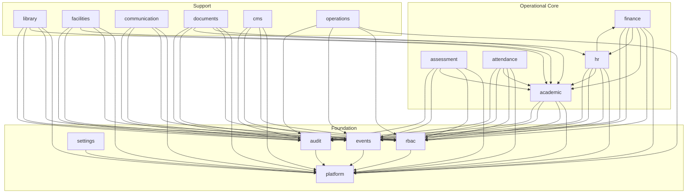
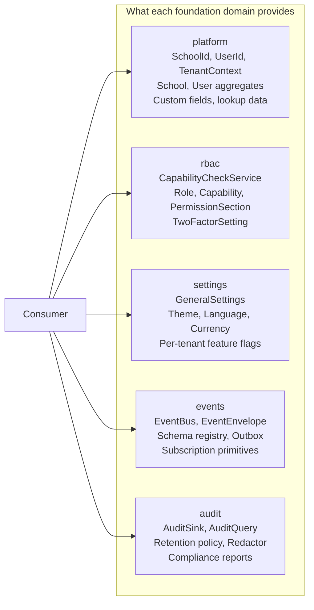
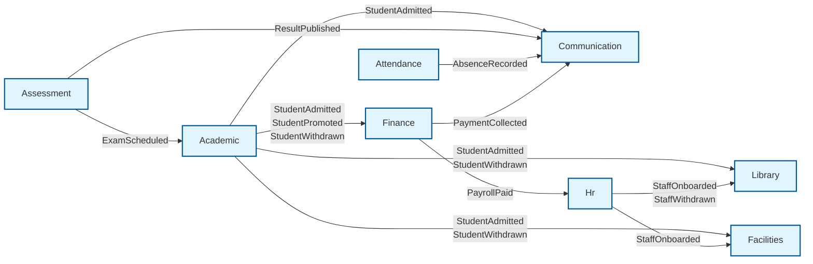
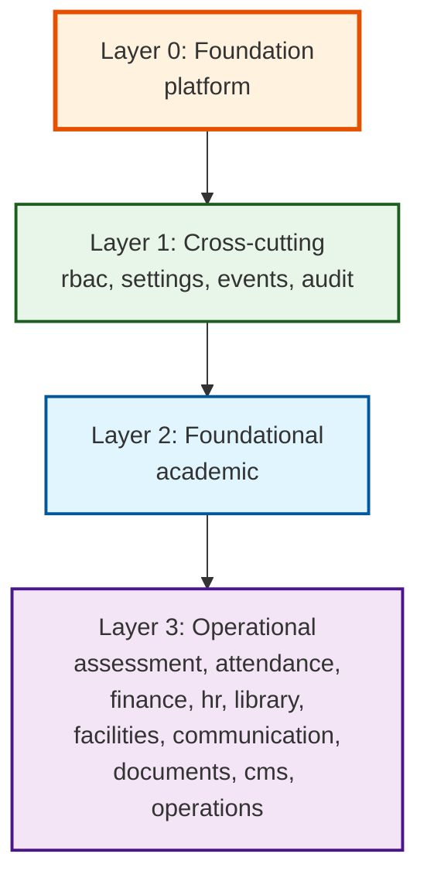
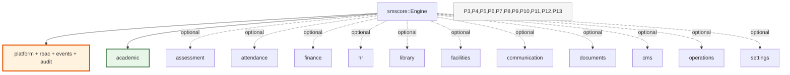

# Domain Map

This document maps the engine's 15 bounded contexts and the
directional dependencies between them. The map is the
authoritative view of "what depends on what?" in SMSengine.

## 1. All 15 Domains

## 2. Foundation Domain Roles

## 3. Cross-Domain Event Flow

## 4. Domain Dependency Hierarchy

## 5. Domain Responsibility Matrix

| Domain              | Primary aggregate       | Owns                                                          |
| ------------------- | ----------------------- | ------------------------------------------------------------- |
| **platform**        | `School`, `User`        | Tenancy, identity, custom fields, lookup data, modules        |
| **rbac**            | `Role`, `Capability`    | Authorization, role catalog, 2FA policy                       |
| **settings**        | `GeneralSettings`       | Per-tenant configuration, theme, language                    |
| **events**          | (port)                  | Event bus, envelope, schema registry, outbox                 |
| **audit**           | (port)                  | Audit log, query, retention, redaction, compliance reports   |
| **academic**        | `Student`, `Class`      | Student lifecycle, classes, sections, subjects, sessions     |
| **assessment**      | `Exam`, `Mark`          | Examinations, marks, results, report cards                   |
| **attendance**      | `AttendanceSession`     | Daily attendance for students and staff                      |
| **finance**         | `Invoice`, `Payment`    | Fees, payments, banking, expenses, payroll, wallet          |
| **hr**              | `Staff`, `Payroll`      | Staff lifecycle, leave, attendance, designations             |
| **library**         | `Book`, `Member`        | Books, members, issues, returns                              |
| **facilities**      | `TransportRoute`, `Room`| Transport, dormitory, inventory                              |
| **communication**   | `Notice`, `Complaint`   | Notices, complaints, chat, notifications                     |
| **documents**       | `Document`, `Dispatch`  | Forms, postal dispatch / receive                             |
| **cms**             | `Page`, `News`          | Public website content                                       |
| **operations**      | `Backup`, `Job`         | Backups, jobs, system versions, audit projections            |

## 6. Domain Enable / Disable

The four foundation crates (`platform`, `rbac`, `events`, `audit`)
plus `academic` are **mandatory** for every deployment. The
remaining domains are optional; the consumer enables them based
on the deployment's scope. A consumer building a small admin
tool may enable only `academic` and `rbac`. A consumer building
a full SaaS school platform enables all of them.
