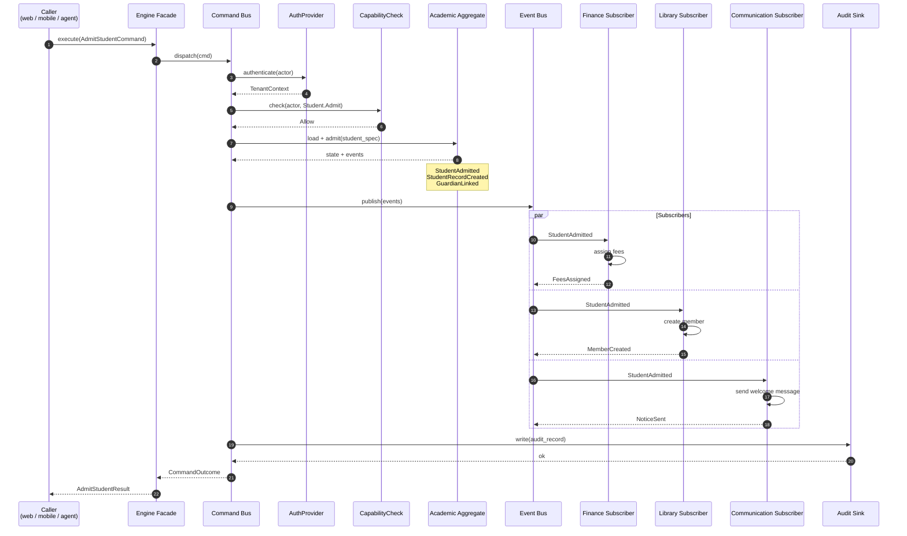
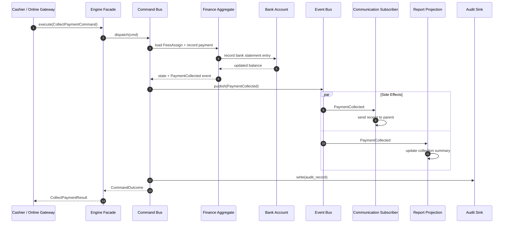
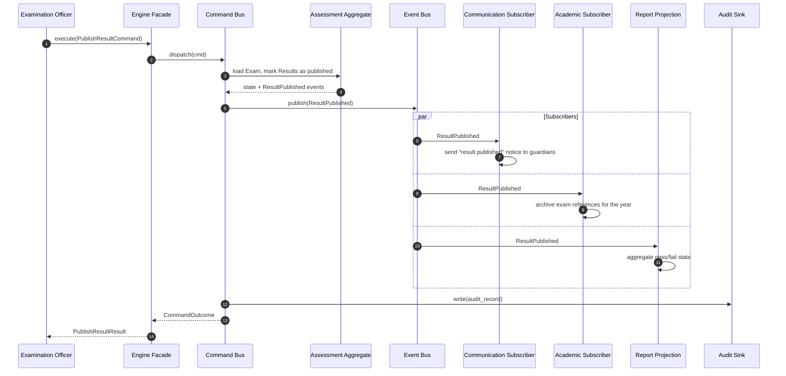
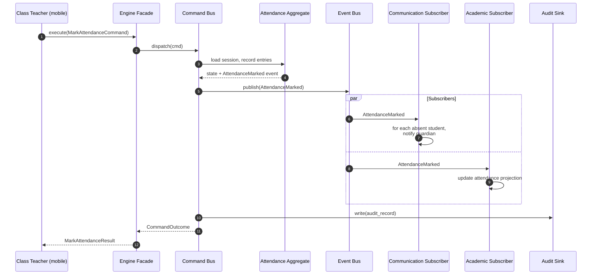
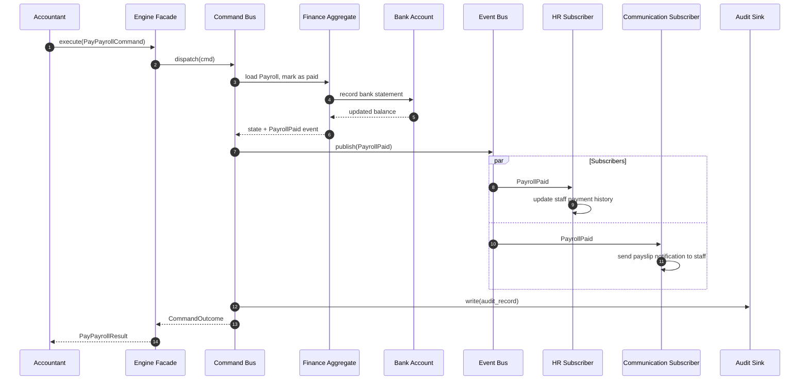
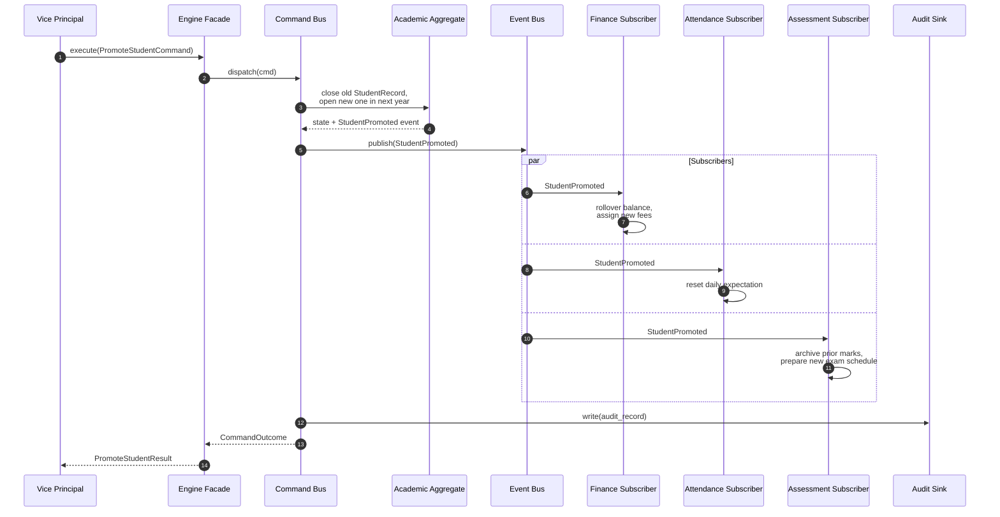
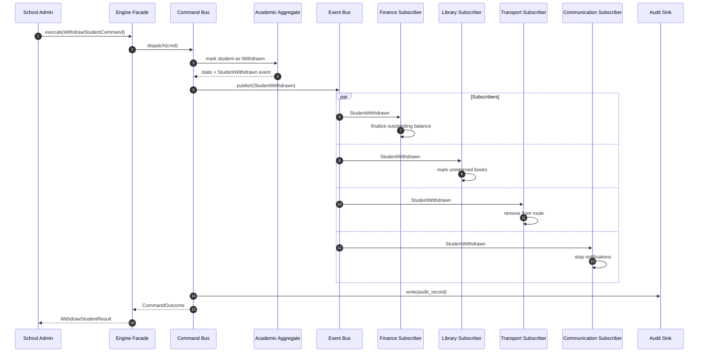

# Event Flow

Sequence diagrams for the engine's key domain events. Each
diagram shows the producer, the bus, the consumers, and the
side effects.

## 1. `StudentAdmitted` — Cross-Domain Fanout



## 2. `PaymentReceived` — Collection, Receipt, Notification



## 3. `ResultPublished` — Cross-Domain Notification Cascade



## 4. `AttendanceMarked` — Daily Cascade



## 5. `PayrollPaid` — Finance → HR Reconciliation



## 6. `StudentPromoted` — Year-End Workflow



## 7. `StudentWithdrawn` — Cleanup Cascade



## 8. Eventual Consistency Window

```mermaid
sequenceDiagram
    autonumber
    participant Caller
    participant Engine
    participant Bus
    participant Sub1 as Subscriber 1
    participant Sub2 as Subscriber 2
    participant Sub3 as Subscriber 3

    Caller->>Engine: execute(AdmitStudent)
    Engine-->>Caller: CommandOutcome (success)
    Note over Engine,Bus: Events committed to outbox
    Bus->>Sub1: StudentAdmitted
    Bus->>Sub2: StudentAdmitted
    Bus->>Sub3: StudentAdmitted
    Note over Sub1,Sub2,Sub3: Subscribers process in parallel.
    Note over Bus: Delivery is at-least-once.
    Note over Sub1,Sub2,Sub3: Each subscriber is idempotent on event_id.
```

The event bus delivers at-least-once. Subscribers MUST
deduplicate on `event_id`. The engine's audit log
mirrors every event with the same `event_id`, providing
a single source of truth.
