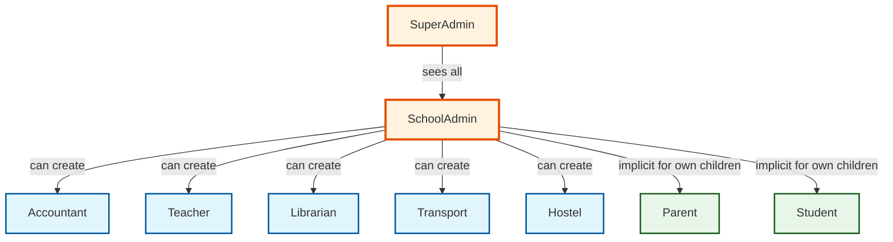
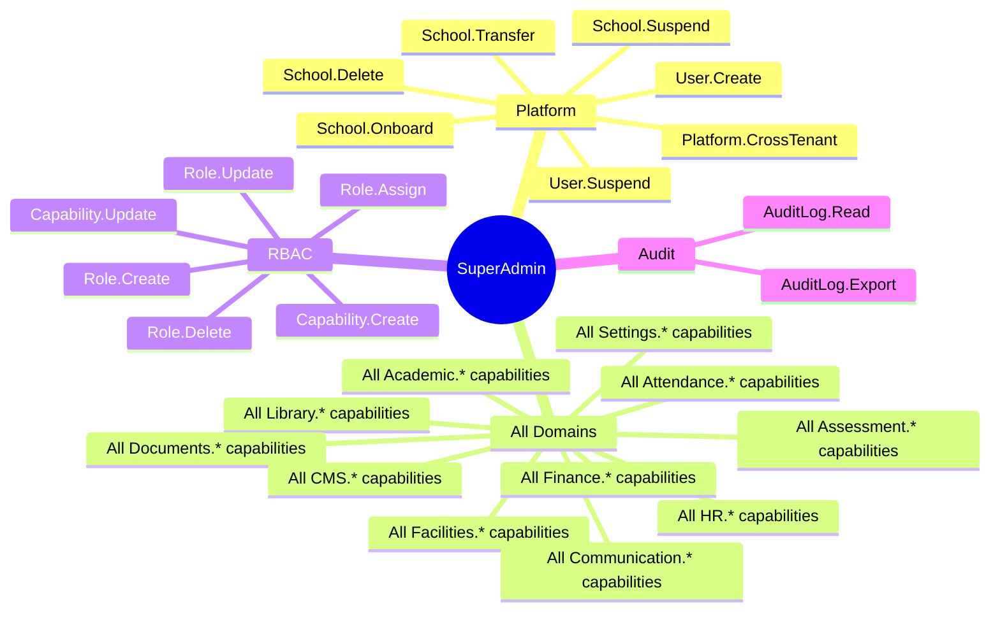
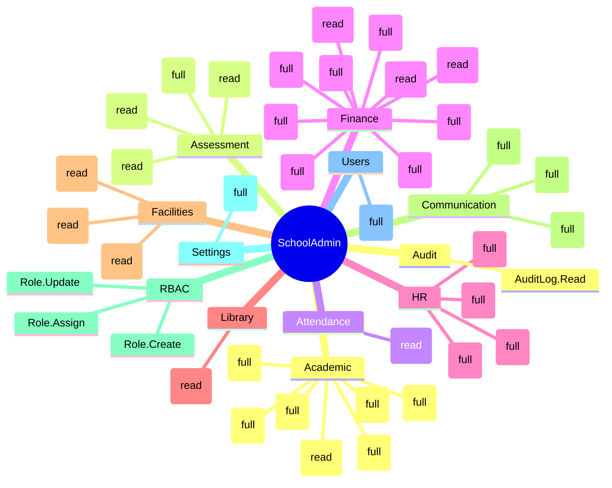
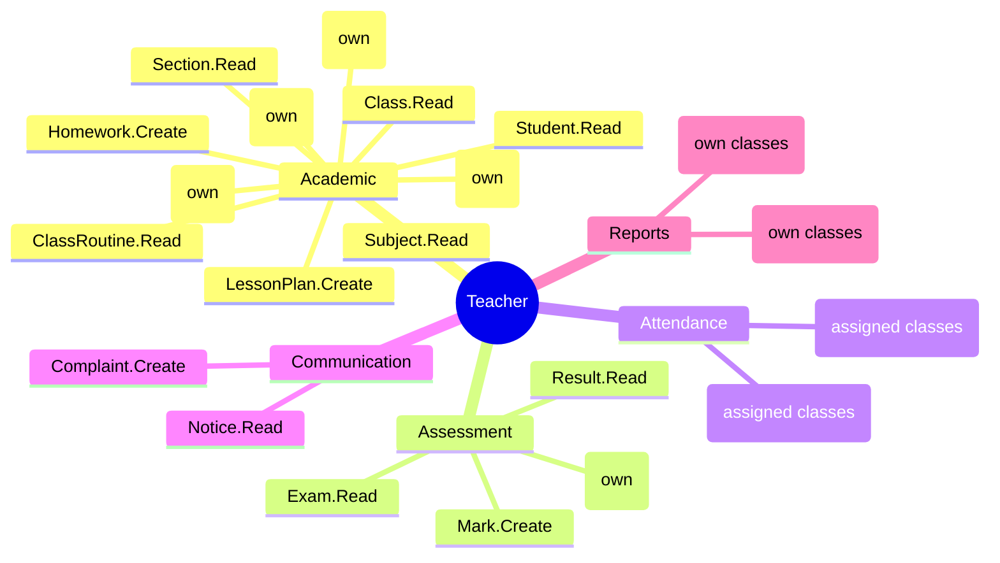
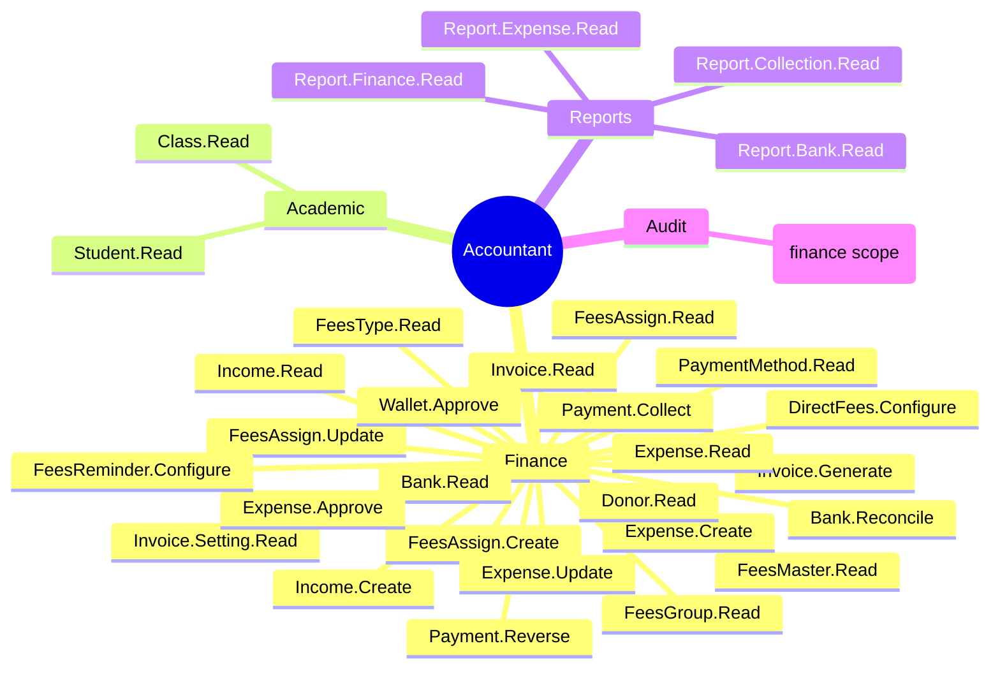
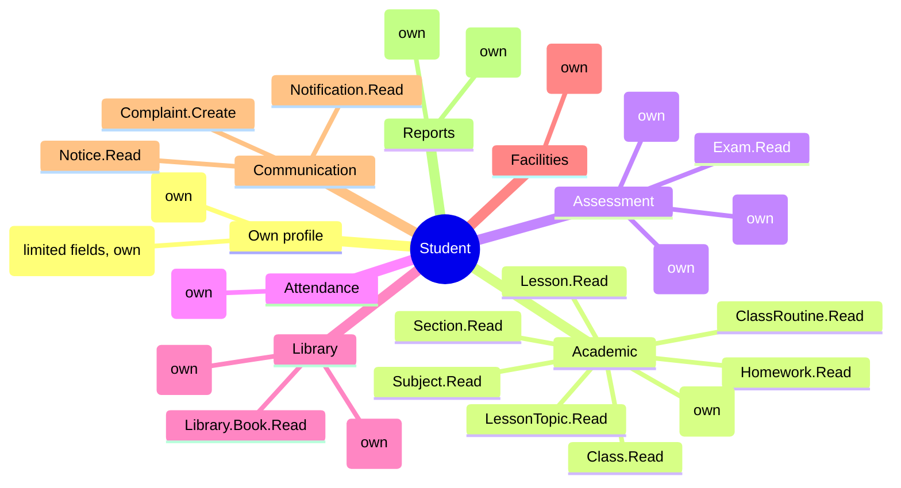
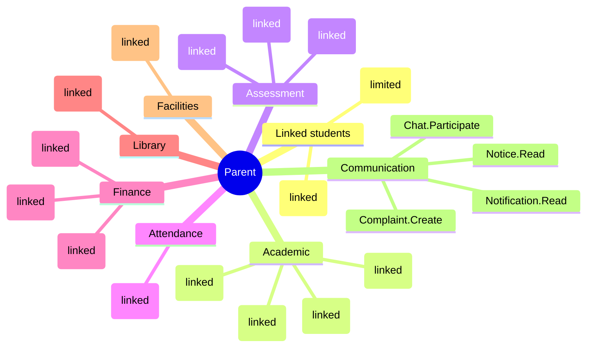
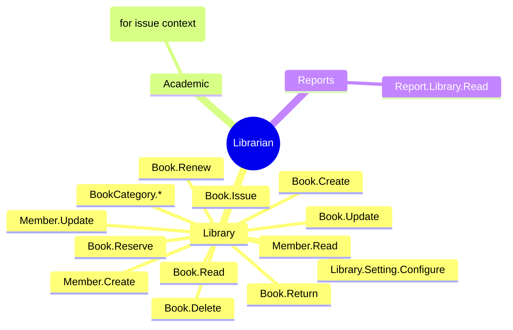
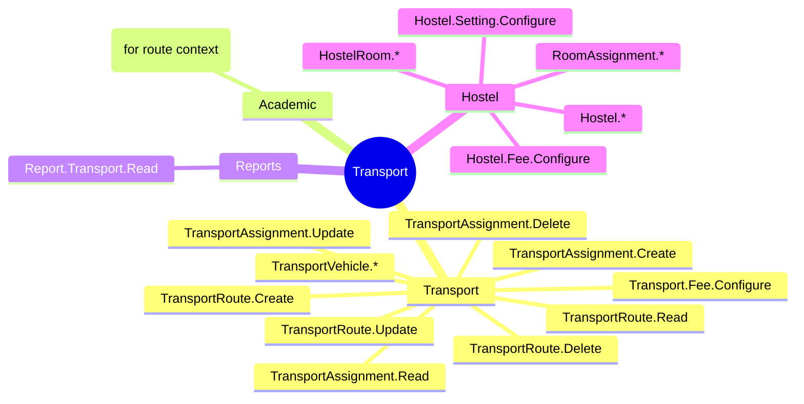

# Permission Map

The role-to-capability mapping for the engine's default role
catalog. Each role is a bundle of capabilities; a user inherits
all capabilities of every role they hold in the active school.

## 1. Role Hierarchy (Default)

The arrows are illustrative (which roles a SchoolAdmin can
create) — they are NOT inheritance. Capabilities are not
inherited from role to role. A SchoolAdmin does not
automatically have Teacher capabilities.

## 2. SuperAdmin Capabilities

The SuperAdmin role has every capability in the engine, in
every school, plus cross-tenant capabilities.

## 3. SchoolAdmin Capabilities

## 4. Teacher Capabilities

## 5. Accountant Capabilities

## 6. Student Capabilities

## 7. Parent Capabilities

## 8. Librarian Capabilities

## 9. Transport / Hostel Capabilities

## 10. Permission Section Map (UI)

```mermaid
graph TB
    UI[UI Sidebar]
    UI --> Sec1[Student Information]
    UI --> Sec2[Academic Setup]
    UI --> Sec3[Attendance]
    UI --> Sec4[Examination]
    UI --> Sec5[Fees Collection]
    UI --> Sec6[Accounts]
    UI --> Sec7[Payroll]
    UI --> Sec8[Human Resource]
    UI --> Sec9[Library]
    UI --> Sec10[Transport]
    UI --> Sec11[Hostel]
    UI --> Sec12[Inventory]
    UI --> Sec13[Communication]
    UI --> Sec14[Reports]
    UI --> Sec15[Settings]
    UI --> Sec16[Roles & Permissions]
    UI --> Sec17[Users]
    UI --> Sec18[School Management]
    UI --> Sec19[Audit]

    Sec1 --> C1[Student.*]
    Sec2 --> C2[Class.*, Section.*, Subject.*, AcademicYear.*]
    Sec3 --> C3[Attendance.*]
    Sec4 --> C4[Exam.*, Mark.*, Result.*, ReportCard.*]
    Sec5 --> C5[FeesGroup.*, FeesType.*, FeesMaster.*, Invoice.*, Payment.*, Bank.*]
    Sec6 --> C6[Expense.*, Income.*, Wallet.*, Donor.*]
    Sec7 --> C7[Payroll.*, SalaryTemplate.*]
    Sec8 --> C8[Staff.*, Leave.*, Department.*, Designation.*]
    Sec9 --> C9[Library.*]
    Sec10 --> C10[Facilities.Transport.*]
    Sec11 --> C11[Facilities.Hostel.*]
    Sec12 --> C12[Facilities.Inventory.*]
    Sec13 --> C13[Notice.*, Complaint.*, Chat.*, Notification.*]
    Sec14 --> C14[Report.*]
    Sec15 --> C15[Settings.*, Theme.*]
    Sec16 --> C16[Role.*, Capability.*, PermissionSection.*, TwoFactor.*]
    Sec17 --> C17[User.*]
    Sec18 --> C18[School.*]
    Sec19 --> C19[AuditLog.*]
```

The `PermissionSection` catalog groups capabilities for UI
rendering. The same grouping helps AI agents reason over
the capability space.
